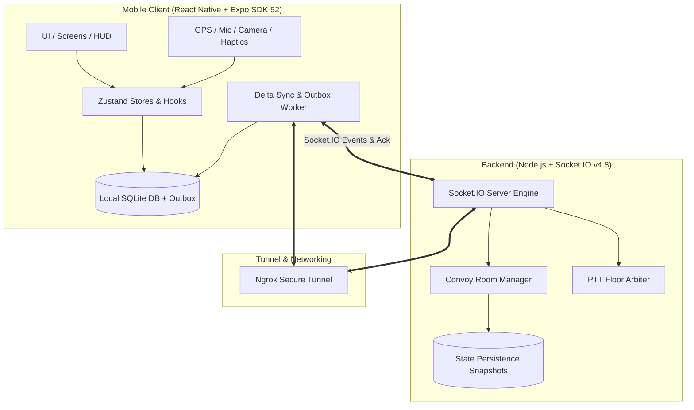

# 🚗 Convoy

> **Real-time mobile road-trip coordination platform featuring live map tracking, push-to-talk (PTT) walkie-talkie, group chat, and resilient offline synchronization.**

[](https://reactnative.dev/)
[](https://docs.expo.dev/router/introduction/)
[](https://nodejs.org/)
[](https://socket.io/)
[](https://www.sqlite.org/)
[](https://www.typescriptlang.org/)

---

## 📖 Overview

**Convoy** is designed for social group road trips and travel adventures where vehicles travel together in formation. It solves the critical safety and usability challenges of highway convoy driving through low-latency telemetry, hands-free and glanceable ergonomics, instantaneous half-duplex voice communication, and resilient local-first offline caching that survives cellular dead zones.

---

## ✨ Key Features

| Feature | Description | Native Hardware / Tech |
| :--- | :--- | :--- |
| 🗺️ **Live Map & Convoy Telemetry** | High-precision map tracking of all vehicles, real-time headings, velocities, convoy leader/tail distance, and glanceable HUD. | GPS (`expo-location`), Google Maps SDK |
| 🎙️ **Push-to-Talk (PTT) Walkie-Talkie** | Low-latency voice communication with strict floor-control arbitration and tactile hold-to-talk button. | Microphone & Audio (`expo-av`), Haptic Motor (`expo-haptics`) |
| 💬 **Group Road-Trip Chat** | In-trip messaging with delivery status, read receipts, and system alerts (e.g. member joins, disconnect warnings). | WebSocket events, SQLite cache |
| 📷 **Instant QR Code Joining** | Shareable 6-character room codes and optical camera QR scanning for zero-friction vehicle onboarding. | Camera (`expo-camera`) |
| 📴 **Offline-First Resilience** | Transactional Outbox pattern that queues outbound actions and synchronizes deltas via monotonic sequence numbers upon reconnect. | SQLite (`expo-sqlite` WAL), Delta-Sync Engine |
| 🔋 **Adaptive Velocity Sampling** | Dynamically throttles GPS polling frequency and transmission payload based on vehicle velocity to optimize battery and cellular bandwidth. | Adaptive Sampling Algorithm |

---

## 🏗️ System Architecture



---

## 📁 Repository Structure

```text
convoy/
├── convoy-client/                 # Mobile Application (React Native / Expo)
│   ├── assets/                    # Icons, splash screens, and raster assets
│   ├── docs/                      # Technical reports, AI logs, and ADRs
│   │   ├── decisions/             # Architectural Decision Records (ADRs)
│   │   └── SE5070_Project_Doc.md  # Detailed Enterprise Mobility Specification
│   ├── src/
│   │   ├── app/                   # Expo Router v4 file-based routes
│   │   │   ├── (convoy)/          # Active convoy routes (map, lobby, qr, settings)
│   │   │   └── (welcome)/         # Onboarding & join routes (create, join, scan)
│   │   ├── components/            # Design system, HUD, markers, modals & PTT button
│   │   ├── db/                    # SQLite database schema, repositories & outbox
│   │   ├── features/              # Domain logic (convoy, location, chat, PTT)
│   │   ├── services/              # Socket.IO client, delta sync, audio playback
│   │   ├── theme/                 # Typography, spacing, and night-drive console theme
│   │   ├── types/                 # Shared domain TypeScript interfaces
│   │   └── utils/                 # Spatial math (Haversine), formatting, constants
│   ├── app.json                   # Expo application manifest
│   ├── eas.json                   # EAS Build profiles (preview, production)
│   └── package.json
│
├── convoy-server/                 # Real-Time Backend Server (Node.js / TypeScript)
│   ├── src/
│   │   ├── handlers/              # Socket event handlers (convoy, location, chat, ptt)
│   │   ├── index.ts               # HTTP & Socket.IO server initialization
│   │   ├── persistence.ts         # JSON snapshot disk persistence
│   │   ├── state.ts               # In-memory convoy room & member state
│   │   ├── tunnel.ts              # Automatic Ngrok tunnel integration with QR generator
│   │   └── types.ts               # Protocol event schemas & payloads
│   ├── Decisions.md               # Backend architectural decisions
│   └── package.json
│
├── .gitignore                     # Monorepo unified ignore rules
└── README.md                      # Project documentation
```

---

## 🚀 Quick Start Guide

### Prerequisites
- **Node.js**: v20+ LTS installed
- **npm** or **yarn**
- **Android Studio** (with Android Emulator) or a physical Android device
- **Expo Go** or **Expo Dev Client** build
- *(Optional)* Free [Ngrok](https://ngrok.com/) account for remote over-the-air testing

---

### 1. Backend Server Setup (`convoy-server`)

1. Navigate to the server directory:
   ```bash
   cd convoy-server
   ```

2. Install dependencies:
   ```bash
   npm install
   ```

3. Configure environment variables:
   ```bash
   cp .env.example .env
   ```
   *Edit `.env` as needed:*
   ```env
   PORT=4000
   # Optional: Ngrok authtoken to automatically tunnel the backend publicly
   NGROK_AUTHTOKEN=your_ngrok_token_here
   ENABLE_NGROK=true
   ```

4. Start the server in development mode:
   ```bash
   npm run dev
   ```
   *The server starts on port `4000`. If Ngrok is enabled, a public HTTPS URL and QR code will be generated in your terminal.*

---

### 2. Mobile Client Setup (`convoy-client`)

1. Navigate to the client directory:
   ```bash
   cd convoy-client
   ```

2. Install dependencies:
   ```bash
   npm install
   ```

3. Configure environment variables:
   ```bash
   cp .env.example .env
   ```
   *Configure `.env` with your values:*
   ```env
   # Google Maps API Key for native map rendering
   EXPO_PUBLIC_GOOGLE_MAPS_API_KEY=your_google_maps_api_key_here

   # Backend socket address (use your Ngrok HTTPS URL or local LAN IP)
   EXPO_PUBLIC_SOCKET_URL=https://your-ngrok-subdomain.ngrok-free.app
   ```

4. Start the Expo development server:
   ```bash
   npx expo start --dev-client
   ```

---

## 🌐 Connecting Devices & Emulators

### Method A: Over Ngrok Tunnel (Recommended for Physical Devices)
1. In `convoy-server/.env`, set `ENABLE_NGROK=true` (and optionally add `NGROK_AUTHTOKEN`).
2. Run `npm run dev` in `convoy-server`. Copy the generated `https://xxxx.ngrok-free.app` URL.
3. Paste the URL into `convoy-client/.env` as `EXPO_PUBLIC_SOCKET_URL`.
4. Launch the mobile app on any physical device or emulator—it connects securely over cellular or Wi-Fi without needing same-network LAN access.

### Method B: Android Emulator Reverse Proxy
If running both server and emulator on the same PC without Ngrok:
```bash
adb reverse tcp:8081 tcp:8081
adb reverse tcp:4000 tcp:4000
```
Set `EXPO_PUBLIC_SOCKET_URL=http://localhost:4000` in `convoy-client/.env`.

---

## 📦 Building Standalone APK (EAS Build)

The project includes pre-configured EAS build profiles in `convoy-client/eas.json`.

To build an installable Android Preview APK:
```bash
cd convoy-client
eas build --platform android --profile preview
```

---

## 📚 Technical Documentation & Research

Detailed documentation, design rationale, and architecture decision records are available in [`convoy-client/docs`](convoy-client/docs):

- **[Enterprise Mobility Project Document](convoy-client/docs/SE5070_Enterprise_Mobility_Project_Document.md)**: Comprehensive assignment documentation covering domain framing, mathematical modeling, and hardware integrations.
- **[DR-001: Music Feature Removal](convoy-client/docs/decisions/DR-001-music-feature-removal.md)**: Rationale on removing third-party audio streaming to prioritize half-duplex PTT floor control.
- **[DR-003: SQLite Local Data Layer & Outbox](convoy-client/docs/decisions/DR-003-sqlite-local-data-layer-and-outbox.md)**: Implementation of local durability and transactional outbox.
- **[DR-004: Monotonic Sequence Numbers & Delta Sync](convoy-client/docs/decisions/DR-004-monotonic-sequence-numbers-and-delta-sync.md)**: Protocol for gap detection and resynchronization.

---

## 📄 License

This project is licensed under the MIT License - see the [`convoy-client/LICENSE`](convoy-client/LICENSE) file for details.
